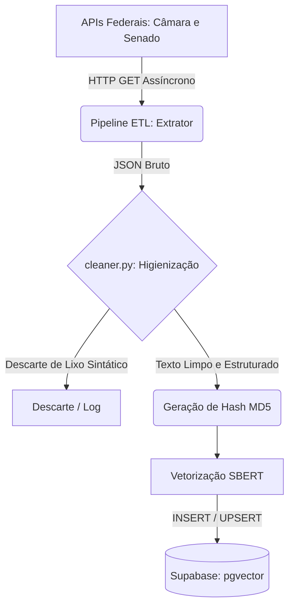

# 🗺️ O Mapa do ETL: Ingestão e Processamento de Dados

**Responsável:** João Guilherme (@jot4-ge)

Este documento detalha a arquitetura do pipeline de Extração, Transformação e Carga (ETL) do **ContraDito**. O objetivo desta camada é garantir a ingestão robusta de discursos, proposições e votos, aplicando uma higienização extrema para blindar os motores de IA contra ruídos semânticos (princípio de *Garbage In, Garbage Out*).

---

## 1. Ciclo de Vida do Dado e Arquitetura

O dado nasce bruto nos servidores do Governo Federal, passa por uma limpeza rigorosa num script assíncrono, é vetorizado pela IA e descansa no banco de dados para consumo imediato do Front-end.

---

## 2. Fontes Primárias e Endpoints Consumidos

A arquitetura consome diretamente a infraestrutura de Dados Abertos do Governo, garantindo respaldo na Lei de Acesso à Informação (LAI).

### Câmara dos Deputados (`/api/v2`)

**Perfis e Discursos:**

- `GET /deputados/{id}/discursos` — Captura transcrição, `urlVideo` e `urlTexto`.

**Ideias e Ações (PECs, PLs e Votos):**

- `GET /proposicoes?siglaTipo=PEC,PL&ano=2023` — Captura a Ementa e o PDF de inteiro teor.
- `GET /votacoes/{id_votacao}/votos` — Retorna a lista nominal: "Deputado X votou Sim/Não".

### Senado Federal

> **Nota de Implementação:** Para evitar colisão de Chaves Primárias no banco, aplica-se um offset de `+1.000.000` nos IDs dos Senadores.

- `GET /materia/pesquisa?sigla=PEC,PL`
- `GET /votacao/materia/{codigo_da_materia}` — Captura a votação nominal dos senadores.

---

## 3. Estrutura de Dados no Supabase (`provas_contradicao`)

A tabela central de inteligência do sistema é a `provas_contradicao`. Abaixo, detalhamos os campos críticos que sustentam o RAG:

| Campo | Tipo | Descrição |
| :--- | :--- | :--- |
| `politico_id` | FK | ID do parlamentar (com offset de +1M para Senadores). |
| `texto_extraido` | TEXT | O texto 100% higienizado pelo `cleaner.py`, pronto para vetorização. |
| `hash_discurso` | MD5 | Chave de idempotência para evitar duplicidade em operações de `UPSERT`. |
| `embedding` | VECTOR(768) | Armazena o vetor gerado pelo SBERT para busca semântica. |
| `link_fonte` | URL | Preserva o link original para garantir transparência e rastreabilidade. |

---

## 4. Regras de Negócio e Transformação (`cleaner.py`)

Para que a Busca Semântica via SBERT funcione corretamente, o texto bruto passa por uma "lavanderia de dados" utilizando Expressões Regulares (Regex):

- **Limpeza Estrutural:** Remoção total de tags residuais de HTML (ex: `
`, ` `).
- **Filtro de Taquigrafia:** Descarte de reações do plenário, como `[Risos]`, `(Pausa)`.
- **Jargões e Protocolos:** Exclusão de frases burocráticas não-semânticas (ex: `"Sr. Presidente, peço a palavra"`).
- **Filtro de Descarte:** Discursos que resultarem em menos de 50 caracteres após a limpeza são descartados automaticamente por falta de densidade informativa.

---

## 5. Rotina de Execução e Carga

Para garantir a eficiência, todas as inserções são tratadas como `UPSERT` baseadas no `hash_discurso`.

### Carga Histórica Fatiada (Backfilling)

Para povoar o banco desde 2023 sem estourar a memória/CPU do Worker NLP, a carga inicial é executada de forma iterativa em blocos semestrais.

### Carga Delta (Rotina Contínua)

- **Frequência:** Semanal.
- **Janela de Execução:** Toda sexta-feira, às 03:00 da manhã.
- **Justificativa:** As atividades legislativas ocorrem primariamente de terça a quinta-feira. Executar na sexta garante que a base esteja atualizada para o pico de acessos do final de semana.
