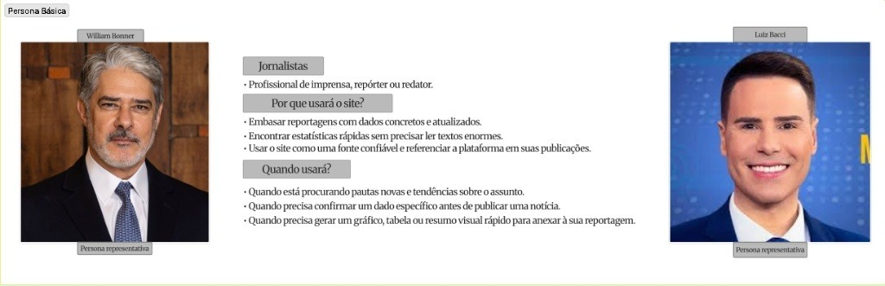

# Story Map e Personas

Para garantir que o **ContraDito** resolva um problema real e entregue valor desde o primeiro dia, baseamos o nosso desenvolvimento em metodologias de design centradas no usuário.

##  A nossa Persona: O Jornalista Investigativo

O sistema foi desenhado especificamente para as necessidades de um **Jornalista Investigativo** ou analista político.

* **O Problema:** Perda de tempo ao analisar horas de vídeos de sessões plenárias e ao cruzar dados de centenas de páginas do Diário Oficial.
* **A Necessidade:** Uma ferramenta rápida, com interface limpa, que faça o cruzamento automático do que foi dito vs. o que foi votado.

> **Nota visual:** A Persona do ContraDito original construída pela equipe no Figma está detalhado abaixo.

##  User Story Map

Mapeamos a jornada do nosso usuário no Figma para definir claramente o que entra no nosso MVP (Produto Mínimo Viável) e o que ficará para atualizações futuras.

### 1. Descobrir e Buscar Políticos
* **MVP (Prioridade Alta):** Pesquisar por nome do parlamentar e utilizar filtros cruzados (Partido e Estado/UF).
* **Melhorias Futuras:** Ranking na página inicial destacando os políticos Mais/Menos Coerentes.

### 2. Analisar Dossiê e Contradições
* **MVP (Prioridade Alta):** Visualizar o Score de Coerência e as evidências em texto extraídas pela Inteligência Artificial.
* **Melhorias Futuras:** Opção para exportar o dossiê completo em formato PDF.

### 3. Comparar Políticos (Lado a Lado)
* **MVP (Prioridade Alta):** Tela "Ringue" para comparar dois políticos, contrastando seus scores e contradições lado a lado.
* **Melhorias Futuras:** Filtros de comparação avançados por temas específicos (ex: economia, meio ambiente).

> **Nota visual:** O User Storymap do ContraDito construído pela equipe no Figma está no link abaixo.
[Acessar Storymap no Figma](https://www.figma.com/board/J6igyv5zX16YPhLaoKM3c4/ContraDito?node-id=0-1&t=Jq1ENqM8V4La6slk-0)